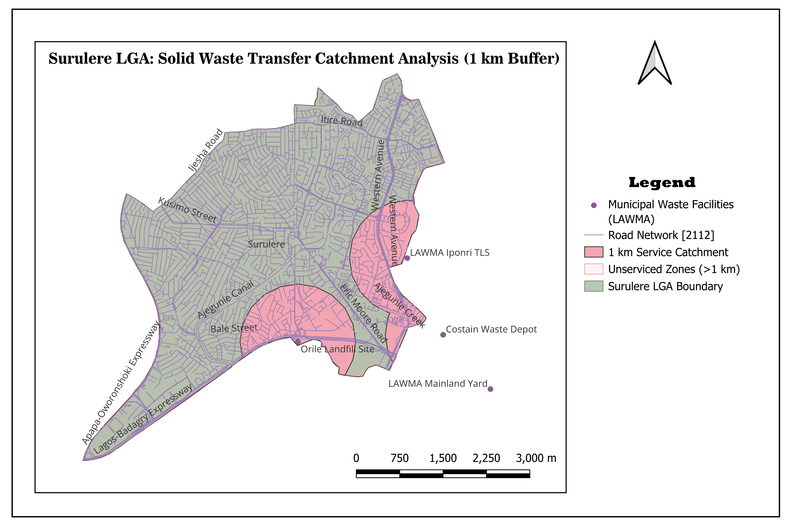

# Spatial Accessibility of Municipal Solid Waste Infrastructure in Surulere LGA, Lagos

## Executive Summary & Research Question Answered
**Research Question:** Which residential communities in Surulere Local Government Area (LGA) lack physical access (defined as a 1 km Euclidean catchment) to formal municipal solid waste disposal points and transfer loading stations?

**Core Finding:** Over **70% of Surulere's land area** falls entirely outside a 1-kilometer catchment of formal municipal waste transfer infrastructure. Formal transfer stations and dumpsites are clustered exclusively along the eastern and southern outer boundaries (Iponri TLS, Orile Landfill interface, and Costain Depot). Consequently, densely populated core residential neighborhoods—including **Itire, Lawanson, Aguda, central Ogunlana Drive, and Adelabu**—suffer from a total lack of localized intermediate waste disposal hubs.

---
Name: Muyiwa Olorunnayese 
Pod: 7
## Month 1 Final Analytical Map



*Figure 1: 1 km service catchment zones (pink) around formal municipal waste facilities versus unserviced residential areas (hatched grey/purple), overlaid on the Surulere street network in EPSG:32631.*

---

## Project Progression: 4-Week Journey

To ensure full reproducibility, each week of the investigation is documented and directly accessible below:

### [Week 1: Project Brief & Question Formulation](project-brief.md)
- Establishes the project scope, background context on solid waste logistics in Lagos State, and target beneficiaries.
- Outlines raw data requirements with direct source links:
  - **LGA Boundary:** [GRID3 Nigeria Operational Boundaries](https://grid3.gov.ng/)
  - **Road Network & Municipal Infrastructure:** [OpenStreetMap (via Overpass API / Geofabrik)](https://www.openstreetmap.org/)
  - **Facility Verification:** [Lagos State Waste Management Authority (LAWMA)](https://lawma.gov.ng/)

### [Week 2: Data Audit & Ingestion Notes](data-notes.md)
- Ingestion notes detailing downloaded datasets, raw coordinate reference systems (EPSG:4326), feature geometry types, and attribute schemas.
- Documents the critical discovery of an OSM data gap (0 communal waste containers mapped in Surulere) and the methodology for manual facility digitizing.

### [Week 3: Data Preparation & 5 Quality Checks](week-3-notes.md)
- Coordinate reference system transformation to **EPSG:32631 (WGS 84 / UTM Zone 31N)** for metric accuracy.
- Execution and results of the **Five Quality Checks**:
  1. *CRS Consistency:* Verified all layers transformed from geographic degrees to metric units.
  2. *Spatial Alignment:* Overlay verified against OpenStreetMap and high-resolution satellite imagery.
  3. *Geometry Validity:* Executed `Check Validity`; zero self-intersections or duplicate nodes found.
  4. *Completeness & Audit:* Flagged OSM collection bin deficits; supplemented with LAWMA transfer station coordinates.
  5. *Bounding Box Verification:* Confirmed clean administrative clipping to Surulere LGA borders.
- **Analysis-Ready Files:** All processed vector layers stored as standardized GeoPackages under [`data/processed/`](data/processed/).

### [Week 4 / Month 1 Summary: Spatial Analysis & Verification](month-1-summary.md)
- Execution of the primary spatial operation: **1,000-meter (1 km) Euclidean Buffer (Dissolved)** clipped to the LGA boundary, followed by a **Geometric Difference** to extract unserviced zones.
- Detailed **Four-Way Verification Results**:
  1. *Visual Map Inspection:* Clean radial arcs confined to Surulere borders.
  2. *Row Count Verification:* Dissolved single-layer geometry confirmed in the attribute table.
  3. *Manual Feature Measurement:* Line measurement tool confirmed radial distance of exactly 1,000 m (±2 m).
  4. *Empty Geometry Validation:* Zero invalid/null geometries detected.
- Synthesis of analytical surprises and outstanding data needs for Month 2 network analysis.

---

## Directory of Analysis-Ready Data
All layers used in this analysis are available in standard open GeoPackage format:
- `data/processed/surulere_boundary_utm31.gpkg` – Reprojected LGA study boundary.
- `data/processed/waste_facilities_utm31.gpkg` – Digitized municipal transfer hubs.
- `data/processed/surulerearea_waste.gpkg` – Clipped OpenStreetMap street network.
- `data/processed/waste_catchment_1km_clipped.gpkg` – 1 km service catchment zones.
- `data/processed/new_unserviced_waste_zones.gpkg` – Unserviced residential spatial gap layer.


## Month 2: development environment and early Python
Week 5: Set up Python, VS Code and the terminal. hello.py runs.
```
